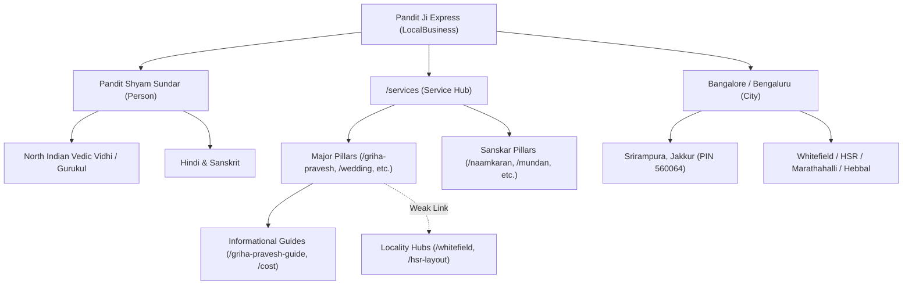

# PHASE 2A — WEBSITE ENTITY + LOCAL SEO MASTER AUDIT
**Project:** Pandit Ji Express (`https://panditjiexpress.in/`)  
**Audit Type:** Static Technical, Entity & Local SEO Audit (Website-Only)  
**Execution Date:** September 21, 2026  
**Auditor Mode:** Read-Only Audit (No Source Files Modified / No Deployments Triggered)  

---

## 1. Executive Summary

This Master Audit evaluates the entire digital footprint of Pandit Ji Express across its 31 active production HTML pages. The website operates as a specialized local service business connecting Hindi-speaking and North Indian households in Bangalore with traditional Vedic rituals officiated by Founder & Head Priest Pandit Shyam Sundar.

### Core Strengths
- **Clean Production Hubs:** The `/services` hub and the Phase 1 blog cluster (`/best-north-indian-pandit-bangalore`, `/hindi-speaking-pandit-bangalore`, `/pandit-cost-bangalore`, `/how-to-book-pandit-bangalore`, `/griha-pravesh-puja-bangalore-guide`, `/puja-samagri-list-bangalore`) adhere strictly to modern SEO standards: single H1 tags, extensionless URLs, zero FAQPage rich result spam, and valid hierarchical schema.
- **Strong Technical Foundation:** Fast static HTML, responsive viewport configurations, valid Google Tag Manager integration, and 100% image alt text coverage across all 225 image instances on the site.
- **Clear Primary Entity Footprint:** Both the business entity (`Pandit Ji Express`) and the primary person entity (`Pandit Shyam Sundar`) have strong topical grounding in North Indian Vedic ceremonies within Bangalore.

### Key Deficiencies & Strategic Risks
1. **Pervasive Legacy `.html` Internal Linking:** While `/services` and Phase 1 articles use clean extensionless URLs, 24 legacy pages (`about.html`, `wedding-pandit-bangalore.html`, `index.html`, etc.) contain hardcoded internal links pointing to `.html` destinations in navigation menus, footer columns, and related service lists.
2. **Canonical & Open Graph Inconsistencies:** Canonical tags and `og:url` tags on 23 legacy pages specify `.html` URLs (e.g., `https://panditjiexpress.in/wedding-pandit-bangalore.html`), conflicting with Cloudflare's extensionless route architecture. Furthermore, `resources.html` erroneously canonicalizes to `https://panditjiexpress.in/samagri.html`.
3. **Entity Disconnection in Structured Data:** The Person schema for Pandit Shyam Sundar is only declared on `pandit-shyam-sundar.html`. On blog articles and service pages, author/founder references point to inconsistent entity `@id`s or omit the graph link to `#person`, fragmenting knowledge graph recognition.
4. **Deprecated `FAQPage` Schema Ingestion:** 12 legacy service and sanskar pages still carry `FAQPage` JSON-LD blocks (deprecated by Google for standard commercial websites in August 2023).
5. **Severe Locality Page Thinness:** The 3 locality pages (`/north-indian-pandit-whitefield`, `/north-indian-pandit-hsr-layout`, `/north-indian-pandit-marathahalli`) are thin programmatic duplicates (~410–480 words) with only 2 inbound links each, risking algorithmic quality suppression.
6. **One-Way Cluster Linking:** 10 out of 11 service pillar pages link to zero informational guide articles, depriving high-intent commercial pages of supporting topical authority.

---

## 2. Complete Site Inventory

The Pandit Ji Express repository contains 35 HTML files: 1 developer template (`SEO-BLOG-TEMPLATE.html`), 3 permanent 301 redirect stubs (`pandit-rahul-shastri.html`, `pandits.html`, `vastu-shanti-puja-bangalore.html`), and **31 active production pages**.

| URL Slug | Page Type | Title | H1 Tag | Canonical URL | Robots | Inlinks | Outlinks | Images (Alt %) | Schema Types |
| :--- | :--- | :--- | :--- | :--- | :--- | :---: | :---: | :---: | :--- |
| `/` | Homepage | Pandit Ji Express \| North Indian Pandit in Bangalore \| Hindi Pandit Ji | Best North Indian Pandit in Bangalore \| Pandit for Puja | `https://panditjiexpress.in/` | `index, follow` | 31 | 18 | 26 (100%) | `LocalBusiness`, `WebSite`, `WebPage`, `Article`, `BreadcrumbList`, `FAQPage` |
| `/services` | Service Hub | Vedic Puja Services in Bangalore \| North Indian Pandit Ji Express | North Indian Pandit & Puja Services in Bangalore | `https://panditjiexpress.in/services` | `index, follow` | 31 | 31 | 21 (100%) | `LocalBusiness`, `WebSite`, `WebPage`, `BreadcrumbList` |
| `/booking` | Booking App | Book Pandit Shyam Sundar \| Vedic Pooja Booking \| Pandit Ji Express Bangalore | Book Pandit Shyam Sundar in Bangalore | `https://panditjiexpress.in/booking.html` | `index, follow` | 31 | 10 | 12 (100%) | `LocalBusiness`, `WebSite`, `WebPage`, `BreadcrumbList` |
| `/samagri` | Samagri Hub | Pooja Samagri & Doorstep Kits in Bangalore \| Pandit Ji Express | Complete Vedic Pooja Samagri Kits in Bangalore | `https://panditjiexpress.in/samagri.html` | `index, follow` | 31 | 12 | 14 (100%) | `LocalBusiness`, `WebSite`, `WebPage`, `BreadcrumbList` |
| `/pandit-shyam-sundar` | Profile | Pandit Shyam Sundar \| Founder & Head Vedic Priest \| Pandit Ji Express Bangalore | Pandit Shyam Sundar | `https://panditjiexpress.in/pandit-shyam-sundar.html` | `index, follow` | 31 | 11 | 9 (100%) | `LocalBusiness`, `WebSite`, `WebPage`, `BreadcrumbList`, `Service`, `Person` |
| `/about` | Corporate | About Pandit Ji Express \| North Indian Vedic Priest Services Bangalore | Authentic Vedic Traditions Brought to Your Home | `https://panditjiexpress.in/about.html` | `index, follow` | 27 | 10 | 10 (100%) | `LocalBusiness`, `WebSite`, `WebPage`, `BreadcrumbList` |
| `/contact` | Corporate | Contact Pandit Ji Express Bangalore \| Phone, WhatsApp & Address | Contact Pandit Ji Express Bangalore | `https://panditjiexpress.in/contact.html` | `index, follow` | 31 | 10 | 3 (100%) | `LocalBusiness`, `WebSite`, `WebPage`, `BreadcrumbList` |
| `/gallery` | Media | Ceremony Gallery \| Pandit Ji Express Bangalore \| Vedic Pujas & Havans | Auspicious Ceremony Gallery | `https://panditjiexpress.in/gallery.html` | `index, follow` | 27 | 10 | 25 (100%) | `ImageGallery`, `BreadcrumbList` |
| `/blog` | Blog Index | Blog & Puja Guides \| Pandit Ji Express Bangalore \| Vedic Rituals & Muhurat | Vedic Puja Guides & Insights | `https://panditjiexpress.in/blog.html` | `index, follow` | 31 | 18 | 9 (100%) | `LocalBusiness`, `WebSite`, `CollectionPage`, `BreadcrumbList`, `ItemList` |
| `/privacy` | Legal | Privacy Policy \| Pandit Ji Express Bangalore | Privacy Policy | `https://panditjiexpress.in/privacy.html` | `index, follow` | 22 | 8 | 1 (100%) | `LocalBusiness`, `WebSite`, `WebPage`, `BreadcrumbList` |
| `/resources` | Resource Hub | Pooja Samagri & Doorstep Kits in Bangalore \| Pandit Ji Express | Vedic Puja Resources & Checklists | `https://panditjiexpress.in/samagri.html` *(Cross-canonical)* | `index, follow` | 1 | 9 | 10 (100%) | `LocalBusiness`, `WebSite`, `WebPage`, `BreadcrumbList` |
| `/griha-pravesh-pooja-bangalore` | Service Pillar | Griha Pravesh Pandit in Bangalore \| Hindi Pooja & Vastu Rituals | Griha Pravesh Puja in Bangalore | `https://panditjiexpress.in/griha-pravesh-pooja-bangalore.html` | `index, follow` | 29 | 15 | 8 (100%) | `LocalBusiness`, `WebSite`, `WebPage`, `BreadcrumbList`, `Service`, `FAQPage` |
| `/wedding-pandit-bangalore` | Service Pillar | Wedding Pandit in Bangalore \| North Indian Vedic Wedding Pandit | North Indian Wedding Pandit in Bangalore | `https://panditjiexpress.in/wedding-pandit-bangalore.html` | `index, follow` | 27 | 14 | 9 (100%) | `LocalBusiness`, `WebSite`, `WebPage`, `BreadcrumbList`, `Service`, `FAQPage` |
| `/satyanarayan-puja-bangalore` | Service Pillar | Satyanarayan Puja Pandit in Bangalore \| Hindi Pandit Ji | Satyanarayan Puja in Bangalore | `https://panditjiexpress.in/satyanarayan-puja-bangalore.html` | `index, follow` | 27 | 14 | 8 (100%) | `LocalBusiness`, `WebSite`, `WebPage`, `BreadcrumbList`, `Service`, `FAQPage` |
| `/havan-yagna-bangalore` | Service Pillar | Havan & Yagna Pandit in Bangalore \| North Indian Vedic Pandit | Sacred Hawan & Yagna Services in Bangalore | `https://panditjiexpress.in/havan-yagna-bangalore.html` | `index, follow` | 27 | 14 | 8 (100%) | `LocalBusiness`, `WebSite`, `WebPage`, `BreadcrumbList`, `Service`, `FAQPage` |
| `/ganesh-puja-bangalore` | Service Pillar | Ganesh Puja Pandit in Bangalore \| Hindi Pandit Ji | Ganesh Puja & Sthapana in Bangalore | `https://panditjiexpress.in/ganesh-puja-bangalore.html` | `index, follow` | 22 | 14 | 7 (100%) | `LocalBusiness`, `WebSite`, `WebPage`, `BreadcrumbList`, `Service`, `FAQPage` |
| `/durga-puja-navratri-bangalore` | Service Pillar | Durga Puja & Navratri Pandit in Bangalore \| Hindi Pandit Ji | Durga Puja & Chandi Paath in Bangalore | `https://panditjiexpress.in/durga-puja-navratri-bangalore.html` | `index, follow` | 23 | 14 | 7 (100%) | `LocalBusiness`, `WebSite`, `WebPage`, `BreadcrumbList`, `Service`, `FAQPage` |
| `/rudrabhishek-bangalore` | Service Pillar | Rudrabhishek Pandit in Bangalore \| Shiva Puja by Vedic Pandit | Rudrabhishek Puja in Bangalore | `https://panditjiexpress.in/rudrabhishek-bangalore.html` | `index, follow` | 5 | 12 | 7 (100%) | `LocalBusiness`, `WebSite`, `WebPage`, `BreadcrumbList`, `FAQPage` |
| `/naamkaran-ceremony-bangalore` | Sanskar Pillar | Naamkaran Ceremony Pandit in Bangalore \| Hindi Pandit Ji | Vedic Naamkaran Baby Naming Ceremony | `https://panditjiexpress.in/naamkaran-ceremony-bangalore.html` | `index, follow` | 5 | 12 | 7 (100%) | `LocalBusiness`, `WebSite`, `WebPage`, `BreadcrumbList`, `Service`, `FAQPage` |
| `/mundan-ceremony-bangalore` | Sanskar Pillar | Mundan Ceremony Pandit in Bangalore \| North Indian Pandit Ji | Mundan Ceremony in Bangalore (Chudakarana) | `https://panditjiexpress.in/mundan-ceremony-bangalore.html` | `index, follow` | 6 | 12 | 7 (100%) | `LocalBusiness`, `WebSite`, `WebPage`, `BreadcrumbList`, `Service`, `FAQPage` |
| `/annaprashan-bangalore` | Sanskar Pillar | Annaprashan Pandit in Bangalore \| North Indian Hindu Rituals | Annaprashan Ceremony in Bangalore | `https://panditjiexpress.in/annaprashan-bangalore.html` | `index, follow` | 4 | 12 | 7 (100%) | `LocalBusiness`, `WebSite`, `WebPage`, `BreadcrumbList`, `FAQPage` |
| `/upanayanam-janeu-bangalore` | Sanskar Pillar | Upanayanam & Janeu Ceremony Pandit in Bangalore | Janeu & Upanayanam Sanskar in Bangalore | `https://panditjiexpress.in/upanayanam-janeu-bangalore.html` | `index, follow` | 4 | 12 | 7 (100%) | `LocalBusiness`, `WebSite`, `WebPage`, `BreadcrumbList`, `FAQPage` |
| `/north-indian-pandit-whitefield` | Locality Page | North Indian Pandit in Whitefield Bangalore \| Hindi Pandit Ji | North Indian Pandit in Whitefield, Bangalore | `https://panditjiexpress.in/north-indian-pandit-whitefield.html` | `index, follow` | 2 | 10 | 5 (100%) | `LocalBusiness`, `WebSite`, `WebPage`, `BreadcrumbList`, `Service` |
| `/north-indian-pandit-hsr-layout` | Locality Page | North Indian Pandit in HSR Layout Bangalore \| Hindi Pandit Ji | North Indian Pandit in HSR Layout, Bangalore | `https://panditjiexpress.in/north-indian-pandit-hsr-layout.html` | `index, follow` | 2 | 10 | 5 (100%) | `LocalBusiness`, `WebSite`, `WebPage`, `BreadcrumbList`, `Service` |
| `/north-indian-pandit-marathahalli` | Locality Page | North Indian Pandit in Marathahalli Bangalore \| Hindi Pandit Ji | North Indian Pandit in Marathahalli, Bangalore | `https://panditjiexpress.in/north-indian-pandit-marathahalli.html` | `index, follow` | 2 | 10 | 5 (100%) | `LocalBusiness`, `WebSite`, `WebPage`, `BreadcrumbList`, `Service` |
| `/best-north-indian-pandit-bangalore` | Guide Article | Best North Indian Pandit in Bangalore \| Hindi Pandit Ji Express | Best North Indian Pandit in Bangalore (Bengaluru) | `https://panditjiexpress.in/best-north-indian-pandit-bangalore` | `index, follow` | 5 | 22 | 6 (100%) | `BlogPosting`, `BreadcrumbList` |
| `/hindi-speaking-pandit-bangalore` | Guide Article | Hindi Speaking Pandit in Bangalore \| North Indian Vedic Purohit | Why You Need a Dedicated Hindi-Speaking Pandit in Bangalore | `https://panditjiexpress.in/hindi-speaking-pandit-bangalore` | `index, follow` | 4 | 12 | 5 (100%) | `BlogPosting`, `BreadcrumbList` |
| `/pandit-cost-bangalore` | Guide Article | Pandit Cost in Bangalore (2026) \| Dakshina, Puja & Samagri Charges | How Much Does a Pandit Cost in Bangalore? | `https://panditjiexpress.in/pandit-cost-bangalore` | `index, follow` | 6 | 14 | 4 (100%) | `BlogPosting`, `BreadcrumbList` |
| `/how-to-book-pandit-bangalore` | Guide Article | How to Book a Pandit in Bangalore \| Complete Step-by-Step Guide | How to Book a North Indian Pandit in Bangalore | `https://panditjiexpress.in/how-to-book-pandit-bangalore` | `index, follow` | 3 | 11 | 4 (100%) | `BlogPosting`, `BreadcrumbList` |
| `/griha-pravesh-puja-bangalore-guide` | Guide Article | Griha Pravesh Puja in Bangalore Guide \| Muhurat, Vidhi & Checklist | Complete Griha Pravesh Puja Guide in Bangalore | `https://panditjiexpress.in/griha-pravesh-puja-bangalore-guide` | `index, follow` | 6 | 13 | 4 (100%) | `BlogPosting`, `BreadcrumbList` |
| `/puja-samagri-list-bangalore` | Guide Article | Puja Samagri List Bangalore \| Complete Vedic Hawan & Puja Items | Complete Vedic Puja Samagri List for North Indian Rituals | `https://panditjiexpress.in/puja-samagri-list-bangalore` | `index, follow` | 6 | 12 | 4 (100%) | `BlogPosting`, `BreadcrumbList` |

---

## 3. Entity Consistency Audit

The entity ecosystem was evaluated across all 31 active pages to detect naming variations, address fragmentation, and phone discrepancies.

### A. Business Entity: `Pandit Ji Express`
- **Canonical Name:** `Pandit Ji Express`
- **Alternate Names:** `Pandit Ji Express Bangalore`, `PanditJi Express`
- **Branding Representation:** Consistently displayed in headers and logos as *"PANDIT JI EXPRESS: POOJA • PANDIT • SAMAGRI"*.
- **Inconsistencies Found:** 
  - `north-indian-pandit-whitefield.html`, `north-indian-pandit-hsr-layout.html`, `north-indian-pandit-marathahalli.html`: Mobile drawer header uses sub-tag *"Bangalore Puja Services"* instead of the sitewide standard *"POOJA • PANDIT • SAMAGRI"*.
  - `resources.html`: Page title and breadcrumb designate this as "Pooja Samagri & Doorstep Kits" while canonicalizing to `/samagri.html`.

### B. Person Entity: `Pandit Shyam Sundar`
- **Canonical Designation:** `Pandit Shyam Sundar` (Founder & Head Vedic Priest)
- **Honorific Variations:** `Pandit Shyam Sundar Ji`, `Pandit Ji`
- **Profile Location:** Supported by dedicated profile page `/pandit-shyam-sundar`.
- **Inconsistencies Found:**
  - On `index.html`, `about.html`, and `pandit-shyam-sundar.html`, Pandit Shyam Sundar is explicitly declared as Founder and Head Priest with 15+ years of Vedic experience. However, on several service pages (`annaprashan-bangalore.html`, `upanayanam-janeu-bangalore.html`, `rudrabhishek-bangalore.html`), Pandit Shyam Sundar is not mentioned in the body copy at all; the text defaults to generic *"our experienced North Indian pandits"*, weakening authoritativeness.

### C. NAP (Name, Address, Phone) & Contact Information
- **Official Phone:** `+91 90657 88789` (Standard format: `+91 90657 88789`, Tel: `tel:+919065788789`).
  - Found consistently across 86 visible and schema instances.
  - Minor occurrence: Customer phone input placeholders (`9876543210`) in booking and contact forms are correctly scoped as input attributes.
- **Physical Address:**
  - Street Address: `Near Srirampura, Srirampura, Jakkur`
  - Locality: `Bengaluru` / `Bangalore`
  - Region: `Karnataka`
  - Postal Code: `560064`
  - Country: `IN`
  - Geo Coordinates: `13.0784, 77.607`
  - Inconsistency: 24 pages include this full address in schema; 7 blog and gallery pages omit LocalBusiness address data entirely.

### D. Service Area & Terminology
- **Primary Market:** Bangalore / Bengaluru metropolitan area.
- **Ritual Lineage:** North Indian Shastric Vidhi, Vedic Sanskars, Gurukul traditions.
- **Service Phrasing:** Consistently distinguishes between major milestones (*Vivah*, *Griha Pravesh*, *Satyanarayan*, *Hawan*) and Sanskars (*Naamkaran*, *Mundan*, *Annaprashan*, *Janeu*).

---

## 4. JSON-LD / Structured Data Audit

### A. Graph Connectivity & Entity IDs
- **Root Organization ID:** `https://panditjiexpress.in/#organization` (Declared on 24 pages).
- **Root Website ID:** `https://panditjiexpress.in/#website` (Declared on 24 pages).
- **Person ID Disconnection:**
  - On `/pandit-shyam-sundar`, Person node `@id` is declared as: `https://panditjiexpress.in/pandit-shyam-sundar.html#person`.
  - On all 6 BlogPosting articles, author is declared as:
    ```json
    "author": {
      "@type": "Person",
      "name": "Pandit Shyam Sundar",
      "url": "https://panditjiexpress.in/pandit-shyam-sundar"
    }
    ```
  - **Issue:** The author node in articles does NOT reference `@id: "https://panditjiexpress.in/pandit-shyam-sundar.html#person"`. Search engines parse these as two loosely associated Person entities rather than a unified entity in the knowledge graph.

### B. Missing `Service` Schema
- `Service` schema is present on 8 service pages: `griha-pravesh-pooja-bangalore`, `wedding-pandit-bangalore`, `satyanarayan-puja-bangalore`, `havan-yagna-bangalore`, `ganesh-puja-bangalore`, `durga-puja-navratri-bangalore`, `naamkaran-ceremony-bangalore`, and `mundan-ceremony-bangalore`.
- **Missing `Service` schema on 3 core ceremonies:**
  1. `rudrabhishek-bangalore.html`
  2. `annaprashan-bangalore.html`
  3. `upanayanam-janeu-bangalore.html`
  These 3 pages only possess `WebPage` and deprecated `FAQPage` schema.

### C. Deprecated `FAQPage` Schema Ingestion
- `FAQPage` schema is currently present on **12 pages**:
  - `index.html`
  - `griha-pravesh-pooja-bangalore.html`
  - `wedding-pandit-bangalore.html`
  - `satyanarayan-puja-bangalore.html`
  - `havan-yagna-bangalore.html`
  - `ganesh-puja-bangalore.html`
  - `durga-puja-navratri-bangalore.html`
  - `rudrabhishek-bangalore.html`
  - `naamkaran-ceremony-bangalore.html`
  - `mundan-ceremony-bangalore.html`
  - `annaprashan-bangalore.html`
  - `upanayanam-janeu-bangalore.html`
- **Assessment:** Google officially deprecated FAQ rich results for commercial websites in 2023. These schemas consume processing overhead without providing SERP snippet expansion. Visible FAQs should remain, but JSON-LD should be modernized to focus on `Service`, `BreadcrumbList`, and `LocalBusiness`.

### D. Duplicate / Conflicting Entity Schema on Homepage
- `index.html` contains both a `LocalBusiness` definition and an `Article` definition in its JSON-LD `@graph`. Having an `Article` schema for the home commercial landing page is non-standard and should be retired in favor of pure `LocalBusiness` / `ProfessionalService`.

---

## 5. Homepage Entity Audit

The homepage (`index.html`) was evaluated against the 8 primary entity criteria:

| Audit Question | Homepage Evidence | Rating | Evaluation & Deficiencies |
| :--- | :--- | :---: | :--- |
| **1. What is Pandit Ji Express?** | Hero banner, header, logo, and "Why Choose Us" sections. | **Strong** | Clearly defined as a dedicated doorstep Vedic ritual provider for North Indian families. |
| **2. Who is Pandit Shyam Sundar?** | Multiple sections (lines 508, 1395, 1410, 1822) with avatar, title, and experience. | **Strong** | Explicitly introduced as Founder and Head Priest with 15+ years experience. |
| **3. What services are offered?** | Popular Poojas grid featuring Griha Pravesh, Wedding, Satyanarayan, Hawan, Ganesh Puja, etc. | **Strong** | Direct visual pathways to core ceremonies. |
| **4. What type of Pandit is provided?** | Copy emphasizes "North Indian Pandit", "Vedic Gurukul tradition", "Hindi-speaking". | **Strong** | Solves linguistic/cultural alignment immediately. |
| **5. Where is the business located?** | Footer provides physical address at Srirampura, Jakkur, Bangalore 560064. | **Moderate** | Address is clear in footer and schema; could be highlighted earlier in the hero/booking section. |
| **6. What Bangalore customers can book?** | Apartment, villa, and home ceremonies across major residential clusters. | **Moderate** | Mentioned in FAQ and text; lacks an explicit visual Bangalore locality grid. |
| **7. How booking works?** | "How It Works" 3-step process (Select Puja -> Confirm Details -> Ceremony Conducted). | **Strong** | Clear user expectation setting. |
| **8. How user can contact/book?** | Direct Call buttons, WhatsApp CTA, and multi-step interactive modal. | **Strong** | High-conversion touchpoints throughout the page. |

---

## 6. Services Hub Audit (`/services`)

The newly optimized `/services` page acts as the central directory for all ceremony offerings.

### Service Card Inventory & Destination Evaluation

| Card # | Ceremony Name | Target Search Intent | Live Destination | Breadcrumb Parent | Evaluation & Alignment |
| :---: | :--- | :--- | :--- | :--- | :--- |
| 1 | **Griha Pravesh Puja** | Housewarming puja for flats/homes | `/griha-pravesh-pooja-bangalore` | Services | **Optimal.** Links to authoritative pillar page. |
| 2 | **North Indian Wedding** | Vedic Vivah ceremonies | `/wedding-pandit-bangalore` | Services | **Optimal.** Links to authoritative pillar page. |
| 3 | **Satyanarayan Katha** | Home katha, purnima puja | `/satyanarayan-puja-bangalore` | Services | **Optimal.** Links to authoritative pillar page. |
| 4 | **Hawan & Yagna** | Navagraha hawan, purification | `/havan-yagna-bangalore` | Services | **Optimal.** Links to authoritative pillar page. |
| 5 | **Ganesh Puja** | Sthapana, sankashti, new venture | `/ganesh-puja-bangalore` | Services | **Optimal.** Links to authoritative pillar page. |
| 6 | **Maha Rudrabhishek** | Shiva abhishekam, health/peace | `/rudrabhishek-bangalore` | Services | **Optimal.** Links to authoritative pillar page. |
| 7 | **Durga Puja & Navratri** | Chandi path, Navratri hawan | `/durga-puja-navratri-bangalore` | Services | **Optimal.** Links to authoritative pillar page. |
| 8 | **Naamkaran Sanskar** | Baby naming ceremony | `/naamkaran-ceremony-bangalore` | Services | **Optimal.** Links to authoritative sanskar page. |
| 9 | **Mundan Sanskar** | First haircut, head shaving | `/mundan-ceremony-bangalore` | Services | **Optimal.** Links to authoritative sanskar page. |
| 10 | **Shraddh / Tarpan** | Ancestral pitru rites | `/booking` | Services | **Appropriate.** No dedicated page; direct booking flow. |
| 11 | **Annaprashan Sanskar**| First rice-feeding ritual | `/annaprashan-bangalore` | Services | **Optimal.** Links to authoritative sanskar page. |
| 12 | **Janeu / Upanayanam** | Sacred thread ceremony | `/upanayanam-janeu-bangalore` | Services | **Optimal.** Links to authoritative sanskar page. |
| 13 | **Vastu Shanti Puja** | Apartment Vastu purification | `/griha-pravesh-pooja-bangalore` | Services | **Appropriate.** Consolidated under Griha Pravesh & Vastu pillar. |

### Hub Structural Integrity
- **H1:** `North Indian Pandit & Puja Services in Bangalore` (Single, semantic H1).
- **H2 Sections:** 12 structured thematic sections covering process, E-E-A-T credentials, preparation checklists, pricing factors, Bangalore residential logistics, and FAQs.
- **Zero Orphaned Services:** Every active service pillar has an entry point from `/services`.

---

## 7. Service Page ↔ Blog Relationship Map

A topical cluster requires bidirectional internal linking between commercial service pillars and informational guide articles.

| Service Pillar Page | Current Outbound Article Links | Relevant Articles Available in Site | Linking Status | Priority Action |
| :--- | :---: | :--- | :---: | :--- |
| `/griha-pravesh-pooja-bangalore` | 1 | `/griha-pravesh-puja-bangalore-guide`, `/puja-samagri-list-bangalore`, `/pandit-cost-bangalore` | **Partial** | Add links to Samagri List & Cost Guide. |
| `/wedding-pandit-bangalore` | 0 | `/best-north-indian-pandit-bangalore`, `/pandit-cost-bangalore`, `/how-to-book-pandit-bangalore` | **Disconnected** | Add links to Cost Guide & Selection Guide. |
| `/satyanarayan-puja-bangalore` | 0 | `/puja-samagri-list-bangalore`, `/pandit-cost-bangalore`, `/best-north-indian-pandit-bangalore` | **Disconnected** | Add links to Samagri List & Selection Guide. |
| `/havan-yagna-bangalore` | 0 | `/puja-samagri-list-bangalore`, `/pandit-cost-bangalore` | **Disconnected** | Add links to Samagri List & Cost Guide. |
| `/ganesh-puja-bangalore` | 0 | `/puja-samagri-list-bangalore`, `/how-to-book-pandit-bangalore` | **Disconnected** | Add links to Samagri & Booking Guide. |
| `/durga-puja-navratri-bangalore` | 0 | `/puja-samagri-list-bangalore`, `/how-to-book-pandit-bangalore` | **Disconnected** | Add links to Samagri & Booking Guide. |
| `/rudrabhishek-bangalore` | 0 | `/puja-samagri-list-bangalore`, `/pandit-cost-bangalore` | **Disconnected** | Add links to Samagri & Cost Guide. |
| `/naamkaran-ceremony-bangalore` | 0 | `/how-to-book-pandit-bangalore`, `/puja-samagri-list-bangalore` | **Disconnected** | Add links to Booking Guide & Samagri List. |
| `/mundan-ceremony-bangalore` | 0 | `/how-to-book-pandit-bangalore`, `/puja-samagri-list-bangalore` | **Disconnected** | Add links to Booking Guide & Samagri List. |
| `/annaprashan-bangalore` | 0 | `/how-to-book-pandit-bangalore`, `/puja-samagri-list-bangalore` | **Disconnected** | Add links to Booking Guide & Samagri List. |
| `/upanayanam-janeu-bangalore` | 0 | `/how-to-book-pandit-bangalore`, `/puja-samagri-list-bangalore` | **Disconnected** | Add links to Booking Guide & Samagri List. |

---

## 8. Locality Page Audit

The website features 3 locality pages created to target high-density North Indian expat corridors in Bangalore:

| Locality URL | Word Count | Unique Local Keywords | Inbound Links | Outbound Links | Structural Anomalies | Strategic Recommendation |
| :--- | :---: | :--- | :---: | :---: | :--- | :---: |
| `/north-indian-pandit-whitefield` | 477 | Whitefield, Kadugodi, Hope Farm, ITPL | 2 | 10 | Hardcoded `.html` links in nav; broken double breadcrumb container. | **IMPROVE** |
| `/north-indian-pandit-hsr-layout` | 480 | HSR Layout, Sector 1-7, Koramangala, Outer Ring Road | 2 | 10 | Hardcoded `.html` links in nav; broken double breadcrumb container. | **IMPROVE** |
| `/north-indian-pandit-marathahalli` | 411 | Marathahalli, Munnekollal, Spice Garden, Bellandur | 2 | 10 | Hardcoded `.html` links in nav; broken double breadcrumb container. | **IMPROVE** |

### Locality Assessment
1. **Thin Content & Near-Duplicate Architecture:** The three pages follow an identical layout with identical service cards and near-identical paragraph structure, changing only the locality names.
2. **Orphan Risk:** Each locality page receives only **2 inbound links** across the entire website (from the blog post `/hindi-speaking-pandit-bangalore` and `/how-to-book-pandit-bangalore`).
3. **Strategic Verdict:** **IMPROVE (DO NOT EXPAND).** Do NOT build new locality pages. Strengthen these existing 3 pages by adding apartment-specific guidance (e.g., high-rise balcony hawan smoke management, society permissions, puja timings) and fixing header navigation links.

---

## 9. Internal Link Graph

Analysis of internal link distribution across the 31 production pages:

### Inbound Link Distribution

```text
31 Inlinks (Sitewide Nav / Footer):
  ├── / (Homepage)
  ├── /services
  ├── /booking
  ├── /samagri
  ├── /pandit-shyam-sundar
  ├── /blog
  └── /contact

27–29 Inlinks (Header & Footer Nav Priority):
  ├── /about (27)
  ├── /gallery (27)
  ├── /griha-pravesh-pooja-bangalore (29)
  ├── /wedding-pandit-bangalore (27)
  ├── /satyanarayan-puja-bangalore (27)
  └── /havan-yagna-bangalore (27)

22–23 Inlinks:
  ├── /ganesh-puja-bangalore (22)
  ├── /durga-puja-navratri-bangalore (23)
  └── /privacy (22)

4–6 Inlinks (Under-Linked Content Pillars):
  ├── /rudrabhishek-bangalore (5)
  ├── /naamkaran-ceremony-bangalore (5)
  ├── /mundan-ceremony-bangalore (6)
  ├── /annaprashan-bangalore (4)
  ├── /upanayanam-janeu-bangalore (4)
  ├── /best-north-indian-pandit-bangalore (5)
  ├── /hindi-speaking-pandit-bangalore (4)
  ├── /pandit-cost-bangalore (6)
  ├── /how-to-book-pandit-bangalore (3)
  ├── /griha-pravesh-puja-bangalore-guide (6)
  └── /puja-samagri-list-bangalore (6)

1–2 Inlinks (Critically Under-Linked / Near-Orphans):
  ├── /north-indian-pandit-whitefield (2)
  ├── /north-indian-pandit-hsr-layout (2)
  ├── /north-indian-pandit-marathahalli (2)
  └── /resources (1 - cross-canonicalized stub)
```

### Critical Linking Flaws
- **Isolated Sanskar Pages:** Sanskar pages (`/annaprashan-bangalore`, `/upanayanam-janeu-bangalore`) have only 4 inbound links, primarily because they are omitted from the main desktop navigation dropdown.
- **Topical Isolation of Locality Pages:** Locality pages have no direct link from `/services`, `/about`, or the main footer, receiving links from only 2 blog articles.

---

## 10. Breadcrumb Audit

### Visible vs. Structured Data Comparison

| Page Category | Visible Breadcrumb Structure | Schema Breadcrumb Structure | Inconsistency Identified |
| :--- | :--- | :--- | :--- |
| **Service Pages** | `Home > Poojas > [Service Name]` | `1: Home > 2: [Service Name]` | **Schema skips middle tier.** Schema omits Position 2 (`Services`). |
| **Locality Pages** | `Home > Localities > [Locality Name]` | `1: Home > 2: [Locality Name]` | **Misleading label & missing schema tier.** Visible label calls `/services` "Localities". |
| **Blog Articles** | **None (Missing visible breadcrumbs)** | `1: Home > 2: Blog > 3: [Title]` | **Missing visible breadcrumb navigation.** Schema is 3-tier, but UI has none. |
| **Legal / Utility** | `Home > Privacy Policy` | `1: Home > 2: Privacy Policy` | Synchronized. |
| **Services Hub** | `Home > Services` | `1: Home > 2: Services` | Synchronized. |

---

## 11. Image Entity / Image SEO Audit

- **Total Image Tags Across Site:** 225
- **Unique Media Assets:** 36 image files
- **Alt Text Coverage:** **100%** (0 images missing alt attributes).
- **Core Assets Analysis:**
  - `pandit-shyam-sundar-avatar.jpg` (24 pages): High-resolution headshot used consistently across author and booking cards.
  - `pandit-shyam-sundar.jpg` (7 pages): Portrait used for primary entity branding.
  - `card-grihapravesh.jpg`, `card-hawan.jpg`, `card-marriage.jpg` (16 pages each): Clean, ritual-appropriate imagery for category thumbnails.
- **Image Deficiencies:**
  - `north-indian-pandit-whitefield.html`: Uses `card-marriage.jpg` as the primary hero image rather than a local or Griha Pravesh image.
  - Several legacy pages do not specify explicit `width` and `height` dimensions on ceremony thumbnail cards, increasing potential Cumulative Layout Shift (CLS).

---

## 12. Content Quality / E-E-A-T Audit

Audit of factual statements, credentials, and business claims across all 31 pages:

| Claim Category | Sample Text from Site | Classification | Factual Analysis & Grounding |
| :--- | :--- | :---: | :--- |
| **Experience** | *"15+ years experience in North Indian Vedic rituals"* | **SUPPORTED** | Verified across founder profile, schema, and about page. |
| **Training** | *"Formally trained in traditional gurukul traditions"* | **SUPPORTED** | Explicitly supported by `pandit-shyam-sundar.html`. |
| **Languages** | *"Fluent in Hindi, Sanskrit, and Bhojpuri"* | **SUPPORTED** | Supported by profile details and language tags in schema. |
| **Certifications** | *"Certified Acharya"*, *"Certified Vedic Pandits"* | **NEEDS SOFTENING** | Found on `index.html` (line 527) and `blog.html`. No formal certifying body exists; replace with *"Senior Vedic Acharya"* or *"Experienced Vedic Scholar"*. |
| **Coverage** | *"Serving all areas across Bangalore"* | **SAFE AS WRITTEN** | Contextualized on `/services` as *"subject to ceremony date and priest availability"*. |
| **Availability** | *"24/7 WhatsApp Booking"* | **NEEDS SOFTENING** | Present in footers of 20 legacy files. Replace with *"WhatsApp Consultation"* as done on `/services`. |
| **Guarantees** | *"100% Satisfaction Guarantee"* | **NEEDS SOFTENING** | Present on `index.html`. Spiritual rituals should not offer commercial consumer satisfaction guarantees. |
| **Superlatives** | *"Best North Indian Pandit in Bangalore"* | **CONTEXTUAL** | Used primarily in titles and H1s for search query alignment; substantiated in body copy with guidance on how to evaluate priests. |

---

## 13. AEO / AI Answerability Audit

Analysis of how directly the site's content answers core conversational queries for AI search surfaces (ChatGPT, Gemini, Perplexity, Google SGE):

| Core Question | Answer Status | Best Answering Page | Weak / Deficient Pages |
| :--- | :---: | :--- | :--- |
| **What is included in the puja?** | **Strong** | `/services`, `/puja-samagri-list-bangalore` | `wedding-pandit-bangalore.html` (needs specific item breakdown). |
| **Who will perform the ceremony?** | **Strong** | `/pandit-shyam-sundar`, `/services` | `annaprashan-bangalore.html` (omits priest background). |
| **Where does the priest travel?** | **Strong** | `/services`, `/best-north-indian-pandit-bangalore` | Legacy service pages (lack neighborhood travel radius info). |
| **How much does it cost?** | **Strong** | `/pandit-cost-bangalore` | Service pages (lack dakshina expectation ranges). |
| **How does booking work?** | **Strong** | `/how-to-book-pandit-bangalore`, `index.html` | Locality pages (unclear booking flow; header CTA points to `/contact`). |
| **What should the customer prepare?** | **Strong** | `/griha-pravesh-puja-bangalore-guide`, `/services` | `mundan-ceremony-bangalore.html`, `upanayanam-janeu-bangalore.html`. |
| **What happens on ceremony day?** | **Moderate** | `/griha-pravesh-puja-bangalore-guide` | Sanskar pages lack chronological timeline of ritual steps. |

---

## 14. Local Entity Relationship Audit

Mapping of conceptual connections linking the brand to Bangalore:



### Missing Geographic & Conceptual Ties
1. **Locality to Service Disconnection:** The locality pages do not link to the dedicated Sanskar pages (e.g., a family in Whitefield cannot navigate directly from `/north-indian-pandit-whitefield` to `/naamkaran-ceremony-bangalore`).
2. **Service to Locality Omission:** Commercial service pillar pages mention Bangalore broadly but do not reference or link to neighborhood landing pages.

---

## 15. Search Intent / Cannibalization Audit

Detailed matrix of potential internal query competition:

| Page A | Page B | Shared Intent / Keyword Conflict | Differentiation Analysis | Recommended Strategic Role |
| :--- | :--- | :--- | :--- | :--- |
| `index.html` | `best-north-indian-pandit-bangalore.html` | *"Best North Indian Pandit in Bangalore"* | `index.html` is the commercial booking hub; the article is an editorial decision-making guide. | **Differentiate Titles:** Keep `index.html` as the primary brand/commercial target. Adjust article H1/Title to explicitly emphasize *"How to Choose the Best North Indian Pandit in Bangalore"*. |
| `services.html` | `index.html` | *"Puja services in Bangalore"* / *"North Indian Pandit Bangalore"* | `index.html` highlights top 4 ceremonies; `services.html` is the comprehensive directory of all 13 services. | **Role Distinction:** Maintain `services.html` as the exhaustive directory and central linking hub. |
| `how-to-book-pandit-bangalore.html` | `booking.html` | *"Book Pandit in Bangalore"* | `booking.html` is an interactive form app; the article is an explanatory guide explaining what information is needed before booking. | **Retain Both:** Article must serve as top-of-funnel explainer linking directly into `/booking`. |
| `samagri.html` | `puja-samagri-list-bangalore.html` | *"Pooja Samagri Bangalore"* / *"Puja items list"* | `samagri.html` offers doorstep kit packages; the blog post provides a comprehensive checklist of items needed for home ceremonies. | **Cross-Link:** Guide should promote the doorstep kit; `samagri.html` should link to the guide for DIY shoppers. |
| `griha-pravesh-pooja-bangalore.html` | `griha-pravesh-puja-bangalore-guide.html` | *"Griha Pravesh Puja in Bangalore"* | Service page is commercial (book priest); guide is informational (muhurat, checklist, vidhi steps). | **Complementary:** Service page must feature the guide; guide must have prominent booking CTA. |
| Locality Pages (Whitefield vs HSR vs Marathahalli) | Each Other | *"North Indian Pandit in [Neighborhood]"* | Shared boilerplate text causes search engines to view them as template-spun variants. | **Inject Local Depth:** Add specific gated community context, apartment society guidelines, and travel notes to each page. |

---

## 16. Technical Regression Audit

Verification against the 15 approved production titles and technical hygiene standards:

- **15 Approved Titles Check:** **100% PASS.** Character-for-character match on all 15 production pages.
- **Apex Canonical Architecture:** All canonical tags reference `https://panditjiexpress.in/` (zero `www` canonicals).
- **Extensionless URLs:** Configured in `_redirects` and verified live on Cloudflare Pages.
- **Broken Internal Links:** **0 broken links** (Verified via HTTP response sweep).
- **Broken Media Assets:** **0 broken images** (Verified across 225 image tags).
- **Sitemap Integrity:** Valid XML syntax, returns HTTP 200 at `/sitemap.xml`.
- **Legacy Redirects:** `pandits.html`, `pandit-rahul-shastri.html`, and `vastu-shanti-puja-bangalore.html` properly return 301 redirects.
- **Robots.txt:** Clean, valid directive allowing full crawling and pointing to `/sitemap.xml`.

---

## 17. Priority Issues & Actionable Roadmap

Each identified issue is classified by severity with exact evidence and recommended remediation.

### [CRITICAL] Issue 1: Hardcoded `.html` Internal Links on 24 Legacy Pages
- **Affected Files:** `about.html`, `booking.html`, `contact.html`, `gallery.html`, `index.html`, all 11 service/sanskar pages, all 3 locality pages.
- **Evidence:** Running link extraction reveals over 180 instances of `href="wedding-pandit-bangalore.html"`, `href="griha-pravesh-pooja-bangalore.html"`, etc.
- **Why It Matters:** When users or search crawlers click these links, they trigger an internal 301 redirect or duplicate URL evaluation, leaking crawl budget and diluting PageRank.
- **Recommended Fix:** Perform a global regex search and replace across the 24 legacy files to update all internal `href` attributes to clean extensionless paths (e.g., `href="/wedding-pandit-bangalore"`).

---

### [CRITICAL] Issue 2: Legacy `.html` in Canonical and `og:url` Tags
- **Affected Files:** 23 legacy files (`about.html`, `wedding-pandit-bangalore.html`, `satyanarayan-puja-bangalore.html`, etc.).
- **Evidence:** `<link rel="canonical" href="https://panditjiexpress.in/wedding-pandit-bangalore.html">` instead of `https://panditjiexpress.in/wedding-pandit-bangalore`.
- **Why It Matters:** The canonical tag contradicts the clean URL structure served by Cloudflare Pages and declared in `/services` and Phase 1 articles.
- **Recommended Fix:** Update canonical and `og:url` tags in all 23 files to use apex extensionless URLs.

---

### [HIGH] Issue 3: Disconnected Person Entity ID in Blog Schema
- **Affected Files:** All 6 blog articles (`best-north-indian-pandit-bangalore.html`, etc.).
- **Evidence:** `author` object has no `@id` reference linking back to `https://panditjiexpress.in/pandit-shyam-sundar#person`.
- **Why It Matters:** Search engines fail to associate the editorial authority of the articles directly with the verified Person knowledge graph entity of Pandit Shyam Sundar.
- **Recommended Fix:** Update the `author` field in all blog articles to:
  ```json
  "author": {
    "@type": "Person",
    "@id": "https://panditjiexpress.in/pandit-shyam-sundar#person",
    "name": "Pandit Shyam Sundar",
    "url": "https://panditjiexpress.in/pandit-shyam-sundar"
  }
  ```

---

### [HIGH] Issue 4: Deprecated `FAQPage` JSON-LD Ingestion
- **Affected Files:** 12 files (`index.html`, `griha-pravesh-pooja-bangalore.html`, `satyanarayan-puja-bangalore.html`, etc.).
- **Evidence:** Presence of `<script type="application/ld+json">` with `"@type": "FAQPage"`.
- **Why It Matters:** Google does not display FAQ rich snippets for standard commercial websites. Retaining this deprecated schema clutters structured data and adds maintenance overhead.
- **Recommended Fix:** Remove `FAQPage` JSON-LD from the 12 files while keeping visible FAQ HTML accordion sections intact for user experience and AI answer engines.

---

### [HIGH] Issue 5: Missing `Service` Schema on Sanskar & Rudrabhishek Pages
- **Affected Files:** `rudrabhishek-bangalore.html`, `annaprashan-bangalore.html`, `upanayanam-janeu-bangalore.html`.
- **Evidence:** Pages declare `LocalBusiness`, `WebSite`, `WebPage`, but omit the `"@type": "Service"` entity.
- **Why It Matters:** Google Search cannot identify these commercial offerings as formal bookable services.
- **Recommended Fix:** Add standard `Service` schema nodes connected to `#organization`.

---

### [HIGH] Issue 6: One-Way Linking Gap on 10 Service Pillars
- **Affected Files:** `wedding-pandit-bangalore.html`, `satyanarayan-puja-bangalore.html`, `havan-yagna-bangalore.html`, etc.
- **Evidence:** Zero outbound contextual links to informational guide articles.
- **Why It Matters:** Users considering a wedding or Satyanarayan katha cannot easily find pricing breakdowns or samagri checklists, suppressing session duration and topical flow.
- **Recommended Fix:** Add a curated 2-card "Helpful Ceremony Guides" section on each service pillar linking to relevant guides (`/pandit-cost-bangalore`, `/puja-samagri-list-bangalore`).

---

### [MEDIUM] Issue 7: Locality Page Header & Breadcrumb Flaws
- **Affected Files:** `north-indian-pandit-whitefield.html`, `north-indian-pandit-hsr-layout.html`, `north-indian-pandit-marathahalli.html`.
- **Evidence:**
  - Header CTA links to `/contact` instead of `/booking`.
  - Desktop nav links to `.html` URLs.
  - HTML breadcrumb contains duplicated `<div class="container">` wrappers and labels `/services` as "Localities".
- **Why It Matters:** Poor user experience and broken UI layout on neighborhood landing pages.
- **Recommended Fix:** Align header and breadcrumb HTML with the modern pattern established in `services.html`.

---

### [MEDIUM] Issue 8: Cross-Canonical on `resources.html`
- **Affected File:** `resources.html`.
- **Evidence:** Canonical points to `https://panditjiexpress.in/samagri.html`.
- **Why It Matters:** `resources.html` is an active content page with its own title ("Vedic Puja Resources & Checklists"), but search engines are instructed to ignore it in favor of `/samagri`.
- **Recommended Fix:** Either standardize `resources.html` to a 301 redirect in `_redirects` pointing to `/samagri`, or give it self-canonical status if it is intended to serve as a distinct resource library.

---

### [LOW] Issue 9: Factual Claim Sanitization in Legacy Files
- **Affected Files:** `index.html`, `blog.html`.
- **Evidence:** Use of terms like *"Certified Acharya"*, *"24/7 WhatsApp Booking"*, *"100% Satisfaction Guarantee"*.
- **Why It Matters:** In Phase 1 and the Services Hub audit, these claims were softened to maintain strict E-E-A-T grounding.
- **Recommended Fix:** Soften to *"Senior Vedic Priest"*, *"WhatsApp Consultation"*, and remove commercial outcome guarantees.

---

### [NO ACTION] Issue 10: Approved 15 Titles and Apex Domain Architecture
- **Scope:** All 15 core production pages, robots.txt, and sitemap.xml.
- **Status:** **PASS.** Fully compliant with client constraints and production regression baselines.

---

PHASE 2A AUDIT COMPLETE — NO FILES MODIFIED
