# Pandit Ji Express — Phase 04 Keyword Strategy & Intent Categorization Report

**Execution Date:** 2026-09-25  
**Auditor:** Senior Search Intent & SERP Feature Architect, Technical SEO Lead  
**Phase:** PHASE 04 — Keyword Strategy & Intent Categorization  
**Phase Status:** **COMPLETE**  
**Repository Scope:** All 35 Production Pages  

---

## 1. Executive Summary

Phase 04 (Keyword Strategy & Intent Categorization) has been executed across the entire Pandit Ji Express platform. The objective of this phase was to construct an uncompromising, mathematically structured keyword and search intent architecture that maps every single canonical URL to a distinct search query cluster, eliminates all keyword cannibalization, aligns on-page heading and metadata hierarchies with SERP expectations, and enforces clear separation between high-conversion transactional pillars and educational informational guides.

### Key Achievements:
1. **100% Query Mapping Coverage (35/35 URLs):** Every canonical URL in the sitemap has been audited, categorized, and documented in both machine-readable JSON ([`local-seo/keyword-map.json`](file:///Users/shekharyadav/Desktop/Projects%20/PanditJiExpress/local-seo/keyword-map.json)) and master documentation ([`seo-docs/SEO_KEYWORD_MAP.md`](file:///Users/shekharyadav/Desktop/Projects%20/PanditJiExpress/seo-docs/SEO_KEYWORD_MAP.md) and [`seo-docs/SEO_SEARCH_INTENT_MAP.md`](file:///Users/shekharyadav/Desktop/Projects%20/PanditJiExpress/seo-docs/SEO_SEARCH_INTENT_MAP.md)).
2. **Zero Keyword Cannibalization:** Confirmed zero overlapping primary keywords across all 35 URLs. Established strict boundaries separating commercial booking landing pages from informational long-form guides.
3. **Intent Distribution Alignment:** 
   * **Transactional / Commercial (18 pages):** Direct booking hubs, service pillars, and localized booking corridors.
   * **Commercial Investigation & Niche (6 pages):** Linguistic fluency (Hindi), regional diaspora (Bihari, Maithil), online puja, and samagri options.
   * **Informational & Educational (7 pages):** 1,500–3,800 word authoritative guides, step-by-step checklists, muhurat and cost breakdowns.
   * **Navigational & Brand Trust (4 pages):** Lead priest bio, organization profile, contact coordination, legal privacy.
4. **Proactive Business Truth Hardening:** Purged the remaining unverified *"Doorstep"* delivery claims from [`samagri.html`](file:///Users/shekharyadav/Desktop/Projects%20/PanditJiExpress/samagri.html) (`<title>`, `<h1>`, Twitter card, WebPage JSON-LD schema, breadcrumb, and benefit cards), ensuring 100% compliance with business truth rules.
5. **Full Test Suite Clearance:** All 5 core npm test suites (`validate-business`, `typecheck`, `lint`, `format:check`, `build`) passed with zero errors (exit code 0).

---

## 2. Intent-Based Funnel Architecture

```mermaid
flowchart TD
    subgraph TOFU["TOFU — Informational & Educational"]
        G1["/best-north-indian-pandit-bangalore (Selection Guide)"]
        G2["/griha-pravesh-puja-bangalore-guide (Housewarming Guide)"]
        G3["/north-indian-wedding-rituals-bangalore (Vivah Rites Guide)"]
        G4["/puja-samagri-list-bangalore (Checklist Guide)"]
        G5["/how-to-book-pandit-bangalore (Process Guide)"]
    end

    subgraph MOFU["MOFU — Commercial Investigation & Locality"]
        M1["/services (Complete Catalog)"]
        M2["/pandit-cost-bangalore (Dakshina Transparency)"]
        M3["/samagri (Kit Options & Sourcing)"]
        M4["/areas-we-serve (Bangalore Locality Directory)"]
        M5["/hindi-speaking-pandit-bangalore (Linguistic)"]
        M6["/bihari-pandit-bangalore (Cultural)"]
        M7["/maithil-pandit-bangalore (Cultural)"]
        M8["/online-pandit-bangalore (Remote E-Puja)"]
    end

    subgraph BOFU["BOFU — High-Intent Transactional Conversion"]
        B1["/ (Home - North Indian Pandit Bangalore)"]
        B2["/wedding-pandit-bangalore (Vivah Booking)"]
        B3["/griha-pravesh-pooja-bangalore (Housewarming Booking)"]
        B4["/satyanarayan-puja-bangalore (Katha Booking)"]
        B5["/havan-yagna-bangalore (Homa Booking)"]
        B6["/ganesh-puja-bangalore (Ganesh Chaturthi)"]
        B7["/durga-puja-navratri-bangalore (Navratri Ghatasthapana)"]
        B8["/rudrabhishek-bangalore (Shiva Abhisheka)"]
        B9["Sanskar Spoke Pages (Naamkaran, Mundan, Annaprashan, Janeu)"]
        B10["Locality Spoke Pages (Whitefield, HSR Layout, Marathahalli)"]
        B11["/booking (Interactive Reservation Form)"]
    end

    TOFU -->|Contextual Links| MOFU
    MOFU -->|Service Inquiries| BOFU
    TOFU -->|Direct CTAs| BOFU
```



---

## 3. Keyword Separation & Cannibalization Prevention Ledger

| Cluster | Transactional Commercial Target | Informational Guide Target | Strategic Separation Boundary |
| :--- | :--- | :--- | :--- |
| **Wedding** | `/wedding-pandit-bangalore`<br>*(Primary: `wedding pandit in bangalore`)* | `/north-indian-wedding-rituals-bangalore`<br>*(Primary: `north indian wedding rituals in bangalore`)* | The service page targets couples hiring a purohit (pricing, dates, mandap rituals). The guide targets families researching the 7 vows, Saptapadi significance, and ritual chronology. |
| **Griha Pravesh** | `/griha-pravesh-pooja-bangalore`<br>*(Primary: `griha pravesh pandit in bangalore`)* | `/griha-pravesh-puja-bangalore-guide`<br>*(Primary: `griha pravesh puja in bangalore process`)* | The service page captures high-intent apartment bookings in Bangalore. The guide captures procedural research (milk boiling vidhi, muhurat calculations, apartment ventilation). |
| **Samagri** | `/samagri`<br>*(Primary: `pooja samagri in bangalore`)* | `/puja-samagri-list-bangalore`<br>*(Primary: `puja samagri list for bangalore ceremonies`)* | The hub page explains kit arrangement policies and what the family provides vs priest brings. The guide provides an exhaustive 40-item checklist for shopping. |
| **General Service** | `/` (Homepage)<br>*(Primary: `north indian pandit in bangalore`)* | `/best-north-indian-pandit-bangalore`<br>*(Primary: `how to choose north indian pandit in bangalore`)* | The homepage acts as the primary local business listing for instant booking. The blog guide acts as an objective decision-making framework vetting credentials. |
| **Pricing** | Commercial Inquiry via `/booking` & `/services` | `/pandit-cost-bangalore`<br>*(Primary: `pandit cost in bangalore`)* | Service pages avoid rigid ungrounded price locks; the Cost Guide transparently educates users on typical Bangalore dakshina factors (ceremony duration, samagri, assistant priests). |

---

## 4. Proactive Business Truth Hardening in `samagri.html`

In alignment with our strict project governance against unverified claims, `samagri.html` underwent a comprehensive text normalization:
* **Title Tag:** Normalized from `Pooja Samagri & Doorstep Kits in Bangalore | Pandit Ji Express` to `Pooja Samagri & Complete Kits in Bangalore | Pandit Ji Express`.
* **H1 Tag:** Normalized from `Pooja Samagri & Doorstep Kits` to `Pooja Samagri & Complete Kits`.
* **Twitter & Open Graph:** Normalized to reflect authentic Vedic puja samagri guidance and arranged ceremony kits.
* **Schema Markup (`WebPage` & `BreadcrumbList`):** Purged all "doorstep delivery" claims from JSON-LD schema definitions.
* **Benefit & Feature Cards:** Replaced generic delivery claims with accurate descriptions of customized ceremony kits arranged according to traditional Vedic lists.

---

## 5. Verification & Test Suite Results

```bash
> npm run validate-business && npm run typecheck && npm run lint && npm run format:check && npm run build
```

| Check Suite | Command | Result | Verification Notes |
| :--- | :--- | :---: | :--- |
| **Business Truth Safeguards** | `npm run validate-business` | **PASS** | 0 prohibited claims across all pages |
| **Typecheck & JSON-LD** | `npm run typecheck` | **PASS** | All JSON-LD structures valid Schema.org syntax |
| **HTML & SEO Lint** | `npm run lint` | **PASS** | 100% compliant titles, meta descriptions, and canonicals |
| **Formatting Integrity** | `npm run format:check` | **PASS** | Clean UTF-8 formatting across repository |
| **Build & Sitemap Sync** | `npm run build` | **PASS** | 35 canonical URLs synchronized with filesystem |
| **Cannibalization Audit** | Regex / Counter Analysis | **PASS** | 0 duplicate primary keywords |
| **Internal Link Hygiene** | Ripgrep / Link Analyzer | **PASS** | 0 `.html` internal links, 0 `.com` links |

---

## 6. Official Phase Status

**PHASE 04 STATUS: COMPLETE AND READY FOR PHASE 05 (Core Priest Service Authority — Wedding, Griha Pravesh, Havan, Satyanarayan, Ganesh, Rudrabhishek)**
